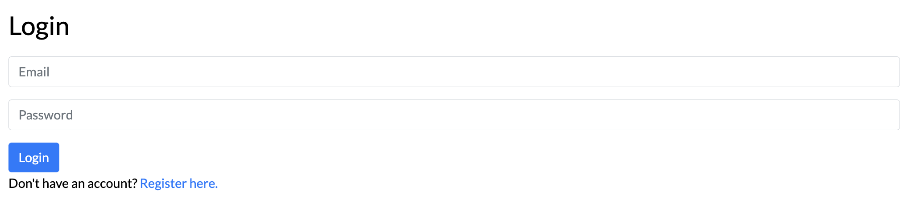
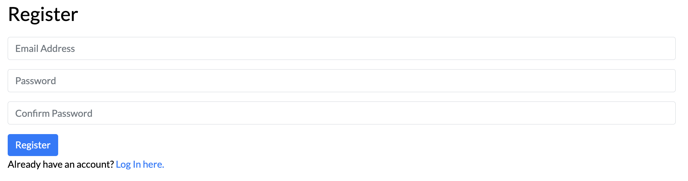
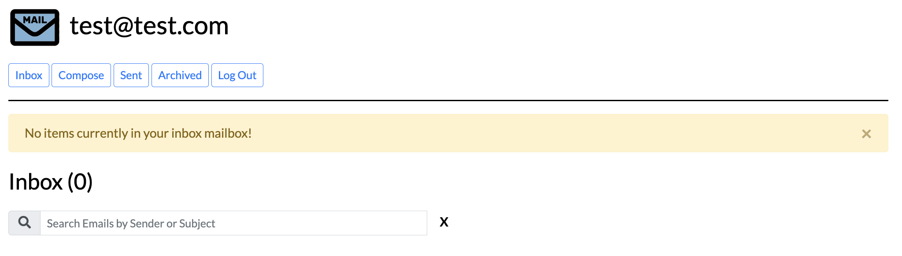

# Email Client App

Technologies:
- Frontend: HTML, CSS, Bootstrap, JavaScript
- Backend: Python, Django





Set up:
- ```pip3 install -r requirement.txt```
- ```python3 manage.py makemigrations mail```
- ```python3 manage.py migrate```

Run locally:
- ```python3 manage.py runserver```
